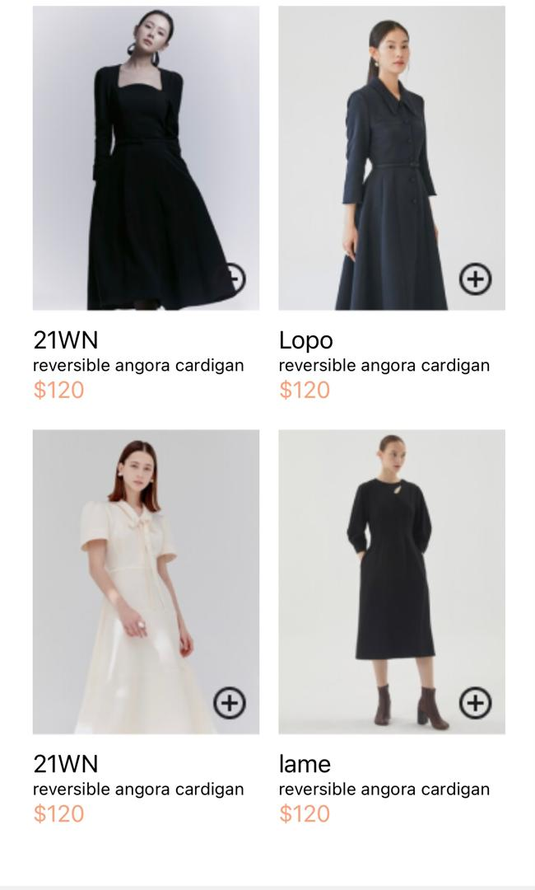
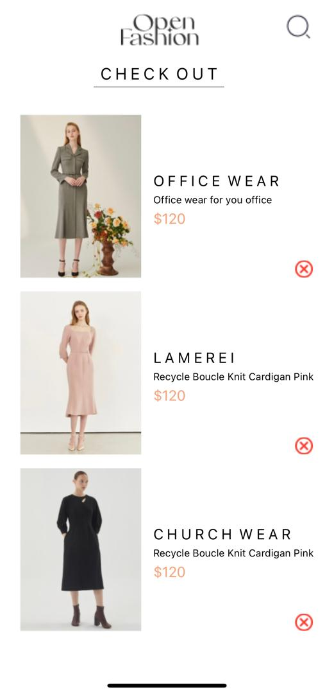

RN-ASSIGNMENT6-11358166

   A DETAILED README FOR THE SHOPPING APP

OVERVIEW
This mobile application is a simple shopping app built using React Native. It allows users to browse products on the HomeScreen, add them to a cart, and remove products from cart on the Cartscreen.

FEATURES
1. HomeScreen: Displays a list of products fetched from a local array (products in HomeScreen.js). It also The displays a list of products using FlatList. Each product is rendered using ProductCard.js.

2. ProductCard: Represents each product with an image, name, description, and price. Allows users to add products to the cart.

3. CartScreen: Shows the products added to the cart. Users can remove products from the cart. it also fetches and displays items from Async-Storage.

4. roduct Listing: Products are listed using a static array (products) within the file.

5. Add to Cart: Each product card has an "Add to Cart" button that allows users to add the product to their cart stored in AsyncStorage.

6. ProductCard
The ProductCard.js component renders individual product items. It includes:
Product Information: Displays the product's image, name, description, and price.
Add to Cart Button: Allows users to add the product to their cart stored in AsyncStorage.

7. View Cart: Shows all products added to the cart.

8. Remove from Cart: Each product in the cart has a "Remove" button (remove.png) that allows users to remove the product from the cart. It updates AsyncStorage accordingly.

9. Storing Cart Items: Products added to the cart are stored in AsyncStorage using JSON serialization.

10. Retrieving Cart Items: Cart items are fetched from AsyncStorage to display in the CartScreen.

INSTALLATION

To run the app locally:
Clone this repository.
Install dependencies with npm install or yarn install.
Run the app using expo start or npm start.
Dependencies
React Native: Version X.XX
@react-native-async-storage/async-storage: Version X.XX
expo: Version X.XX (if using Expo)
Other dependencies as listed in package.json.
Usage
Navigate to the HomeScreen to view available products.
Tap "Add to Cart" on any product to add it to your cart.
Navigate to the CartScreen to view and manage items in your cart.
Tap "Remove" on any product in the cart to remove it.

